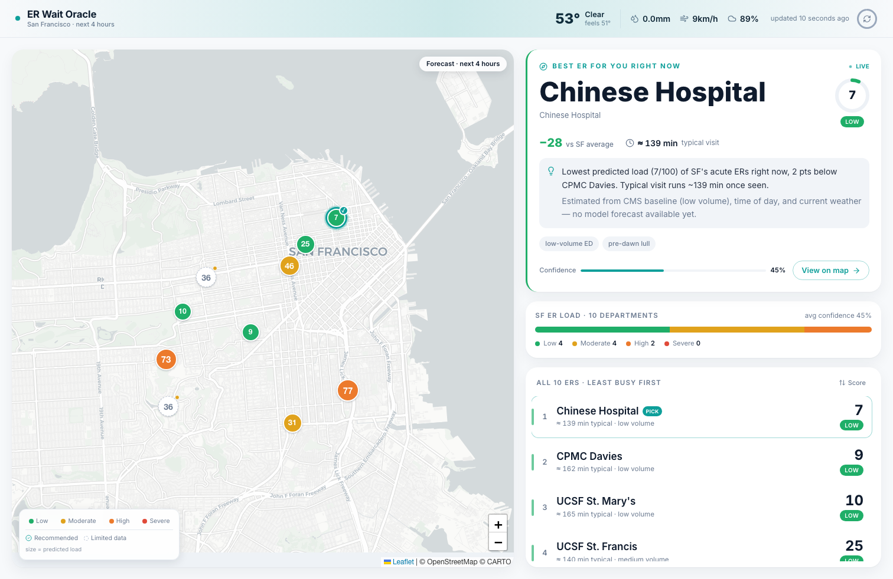

# ER Wait Oracle — Web Dashboard

A live San Francisco ER triage board. It reads from the **same ClickHouse** the
[ingestion pipeline](../README.md) writes to and answers one question in under two
seconds: **which ER should you go to right now?**



## What it shows

- **Live map** of all 10 SF hospitals on a pale CARTO Positron basemap (free OSM
  tiles, no API token). Each marker is a color-coded "score pill" — green→amber→
  orange→red by predicted busyness, sized subtly by load. The single recommended
  ER wears a calm **teal breathing halo** (the *calmest* marker, not the loudest —
  red markers are the ones to avoid). The two hospitals without CMS ED baselines
  render as hollow dashed pills labeled "limited data".
- **"Best ER for you right now"** hero card — a poster-scale verdict with the
  busyness score, a "−N vs SF average" delta, the tangible "≈ N min typical visit"
  throughput, and the reasoning behind the pick.
- **SF ER load** distribution bar across all 10 departments.
- **Ranked list**, least-busy first, cross-highlighted with the map (hover either,
  the other lights up; click a row to fly the map to it).
- **Auto-refreshes every 5 minutes** with a visible countdown ring, "updated Xm
  ago" label, and a teal sync-sweep across the header on each successful refresh.

## Design

Aesthetic and interactions follow a spec chosen by a 3-direction design panel +
judge vote: **"Calm Clinical, Verdict Edition"** — Apple-Health-meets-Linear, with
teal as a dedicated "where to go" channel kept chromatically separate from the
four busyness hues so *which one* and *how busy* never collide.

## Run it

```bash
# 1. Make sure ClickHouse is up and has data (from the repo root):
cd ..
docker compose up -d
npm run init-db && npm run ingest      # and `npm run predict` if you have an API key
cd web

# 2. Start the dashboard
cp .env.local.example .env.local       # defaults already point at localhost:8123
npm install
npm run dev                            # http://localhost:3000
# or: npm run build && npm start
```

`.env.local` uses the **same `CLICKHOUSE_*` variables** as the pipeline.

## Data, model vs. heuristic, and graceful degradation

The dashboard prefers the pipeline's Claude forecast (`predictions` table). For any
hospital without a model row yet (e.g. before `ANTHROPIC_API_KEY` is configured), it
falls back to a **transparent heuristic** (CMS baseline + time-of-day + weather),
clearly labeled as an estimate — so the board is always populated and honest.

If ClickHouse is briefly unreachable, the API still returns all 10 markers from the
static hospital table with time-based estimates, and the UI keeps the last-good data
on screen with a soft "connection hiccup" banner — **never a blank screen on stage.**

## Architecture

```
app/
  api/dashboard/route.ts   one endpoint: baselines + forecasts + weather + recommendation
  layout.tsx · page.tsx · globals.css
lib/
  clickhouse.ts            server-only client (never-throws query wrapper)
  hospitals.ts             10 SF hospitals: coords, short names, ED/non-ED
  busyness.ts              score→level + the heuristic fallback
  theme.ts · types.ts      palette + the shared /api/dashboard contract
hooks/
  useDashboard.ts          fetch + 5-min refresh + keep-last-good
  useCountUp.ts · useCountdown.ts
components/
  AppShell · Header · WeatherStrip · RefreshIndicator
  MapPanel → MapInner      react-leaflet (client-only), custom divIcon markers
  RecommendationCard · CityVitals · HospitalList · primitives
```

Stack: Next.js 14 (App Router) · React 18 · TypeScript · Tailwind · react-leaflet +
Leaflet · lucide-react · date-fns. All motion is CSS/SVG (no animation library).
